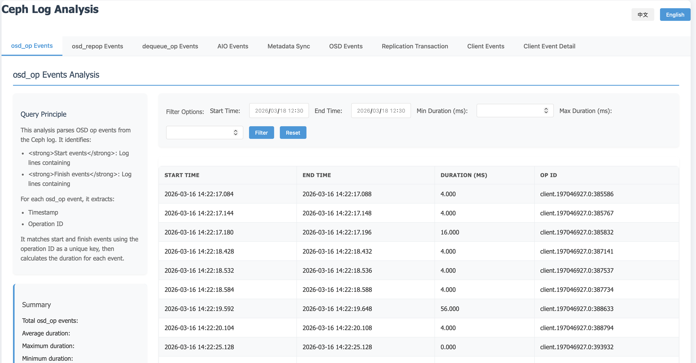

# Ceph 日志分析工具

一个全面的 Ceph OSD 日志分析工具，支持分析 AIO 操作、OSD repop 操作、OSD 操作、事务操作和元数据同步操作。

## 功能特性

- **多类型分析**：支持分析九种类型的操作：
  - AIO (异步 I/O) 操作
  - OSD repop 操作
  - OSD 操作
  - 事务操作
  - 元数据同步操作
  - 客户端操作
  - 客户端操作详情
  - 出队操作
  - OSD op 事件
- **HTML 输出**：生成结构良好、视觉美观的 HTML 报告，带有标签页界面
- **统计摘要**：为每种操作类型显示全面的统计信息
- **筛选功能**：允许按时间范围和持续时间/延迟进行筛选
- **持续时间分布**：显示操作按持续时间/延迟范围的分布情况
- **查询原理解释**：提供每种操作类型如何解析和分析的清晰解释
- **模块化设计**：按照 Go 最佳实践组织为清晰、可维护的包结构

## 安装

### 前提条件
- Go 1.16 或更高版本

### 设置
1. 克隆仓库：
   ```bash
   git clone https://github.com/liucxer/analyze_ceph_log.git
   cd analyze_ceph_log
   ```

2. 构建项目：
   ```bash
   go build -o analyze_ceph .
   ```

## 使用方法

### 命令语法
```bash
# 使用构建好的二进制文件
./analyze_ceph <log_file> <analysis_type> [output.html]

# 使用 go run
go run main.go <log_file> <analysis_type> [output.html]
```

### 分析类型
- `aio` - 分析 AIO 操作
- `repop` - 分析 OSD repop 操作
- `op` - 分析 OSD 操作
- `transaction` - 分析事务操作
- `metadata` - 分析元数据同步操作
- `client` - 分析客户端操作
- `dequeue` - 分析出队操作
- `all` - 分析所有操作类型

### 示例

1. 分析所有操作并生成 HTML 报告：
   ```bash
   go run main.go /path/to/ceph-osd.log all analysis.html
   ```

2. 仅分析 AIO 操作：
   ```bash
   go run main.go /path/to/ceph-osd.log aio aio_analysis.html
   ```

3. 分析 OSD 操作：
   ```bash
   go run main.go /path/to/ceph-osd.log op osd_analysis.html
   ```

4. 分析事务操作：
   ```bash
   go run main.go /path/to/ceph-osd.log transaction transaction_analysis.html
   ```

5. 分析元数据同步操作：
   ```bash
   go run main.go /path/to/ceph-osd.log metadata metadata_analysis.html
   ```

6. 分析客户端操作：
   ```bash
   go run main.go /path/to/ceph-osd.log client client_analysis.html
   ```

7. 分析出队操作：
   ```bash
   go run main.go /path/to/ceph-osd.log dequeue dequeue_analysis.html
   ```

## 输出

该工具生成的 HTML 报告包含：

- **标签页界面**：每种操作类型都有单独的标签页，包括：
  - OSD op 事件
  - OSD repop 事件
  - dequeue_op 事件
  - AIO 事件
  - 元数据同步
  - OSD 事件
  - 复制事务
  - 客户端事件
  - 客户端事件详情
- **查询原理部分**：每种操作类型如何解析和分析的清晰解释
- **摘要部分**：每个标签页顶部的关键统计信息
- **筛选表单**：每个表格的时间范围和持续时间/延迟筛选
- **数据表格**：详细的操作列表，包含时间戳和持续时间
- **持续时间分布**：按持续时间/延迟范围细分的操作
- **分页功能**：所有数据表格都有分页功能，默认每页100项

### HTML 报告截图



## 项目结构

```
analyze_ceph_log/
├── main.go               # 主入口点
├── go.mod                # Go 模块文件
├── .gitignore            # Git 忽略文件
├── README.md             # 英文 README
├── README_zh.md          # 中文 README
├── js/                   # 前端功能的 JavaScript 文件
└── pkg/                  # 包目录
    ├── analyzer/         # 分析逻辑
    ├── html/             # HTML 生成
    │   └── panels/       # 面板特定的 HTML 生成
    ├── log/              # 日志解析
    └── types/            # 类型定义
```

## 工作原理

1. **日志解析**：使用正则表达式从 Ceph 日志中提取相关信息
2. **事件匹配**：匹配开始和结束事件以计算持续时间
3. **数据分析**：计算统计信息和持续时间分布
4. **HTML 生成**：创建结构良好的 HTML 报告，带有筛选功能

## 贡献

欢迎贡献！请随时提交 Pull Request。

## 许可证

本项目是开源的，根据 MIT 许可证提供。
